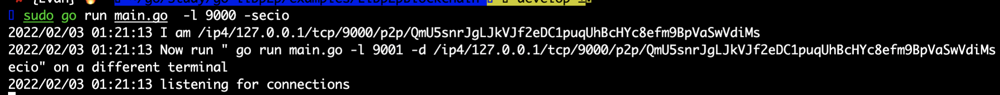
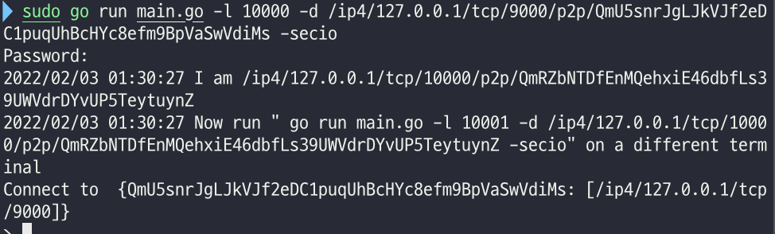
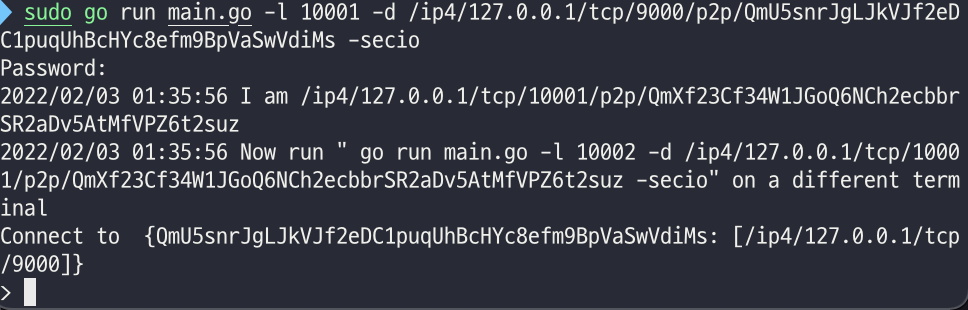
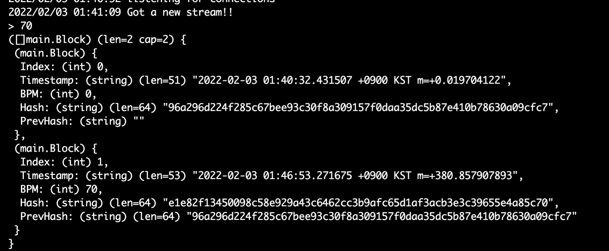
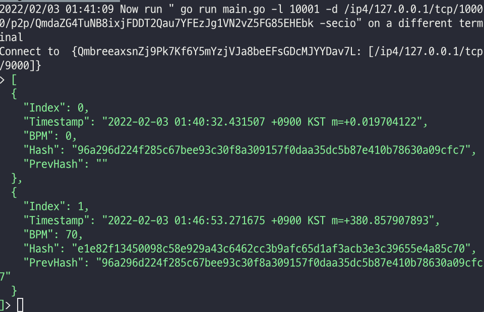
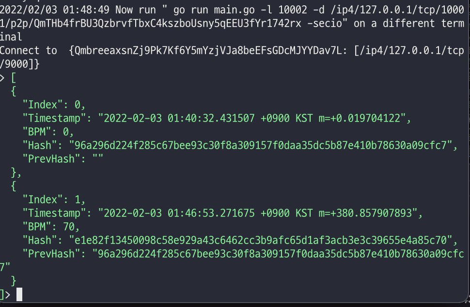

# Libp2pBlockchain

## Introduction

This program is a simple blockchain network implementation using P2P communication based on the Libp2p library.

The program represents the process of broadcasting the connected peer nodes' blockchain information by counting the pulse rate (BPM) for one minute and updating the corresponding value to the blockchain.

The project was created by referring to the link below. However, the code in the link below is too old, so I modified some source codes.

https://mycoralhealth.medium.com/code-a-simple-p2p-blockchain-in-go-46662601f417

## Prerequisites

* go version 1.16 
* go-libp2p version 0.17.0

## Getting Started

### Installation

* go mod init <your project path (e.g. github.com/leeyk/Libp2pBlockchain)>
* go get github.com/libp2p/go-libp2p@latest
* go get github.com/davecgh/go-spew/spew
* go mod tidy

### Test Drive

* On your first terminal, `` go run main.go -l 9000 -secio``

  * -l : wailt for incoming connections
  * -secio : enable secio encrypto communication

  

* Follow the instructions that say "Now run ...".

* Open up a 2nd terminal, go to the same directory and ``go run main.go -l 10000 -d <given address in the instructions> -secio``

  * -d : target peer to dial

* You'll see the first terminal detected the new connection
  
* open up a 3rd terminal, go to the same working directory and ``go run main.go -l 10001 -d <given address in the instructions> -secio``

* You'll see the first terminal detected the new connection

* Now let's start inputting out BPM data. Type in "70" in out 1st Terminal, give it a few seconds and watch what happens in each terminal.
* Terminal1
  * Terminal1 added a new block to its blockchain
* 

* Terminal2
  * Terminal1 message broadcast it to Terminal2
  * Terminal2 compared it against its own blockchain, which only contained its genesis block. It saw Terminal1

* Terminal3
  * Terminal3 compared the new chain against its own and replaced it. 

* All 3 terminals updated their blockchains to the latest state with no central authority! This is the power of Peer-to-Peer
